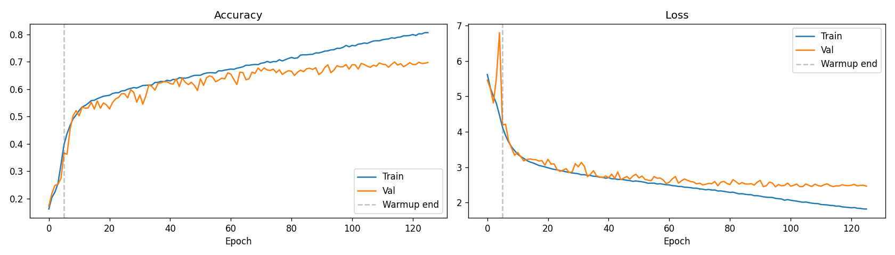
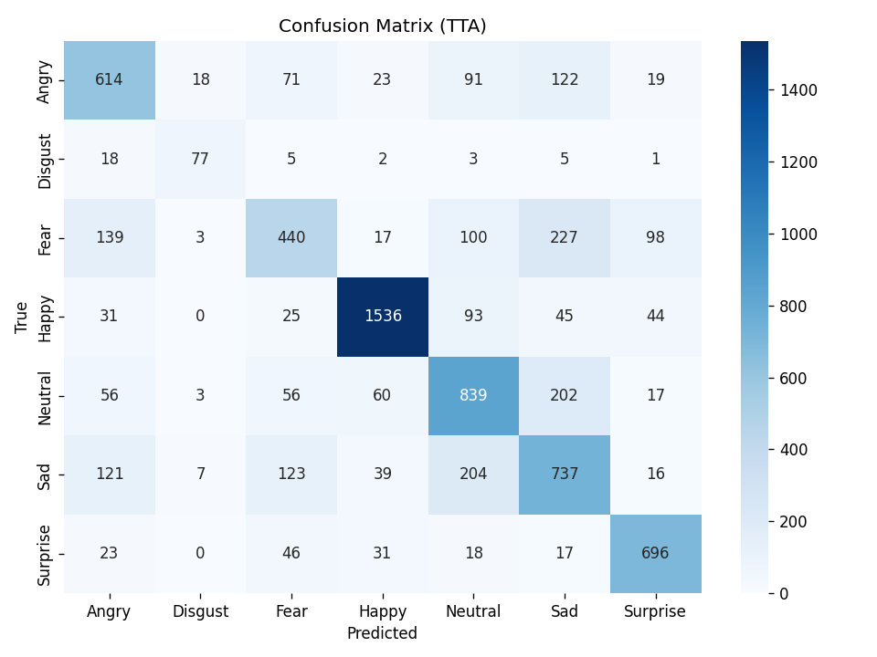

# 😶 Real-Time Face Emotion Recognition

> A deep learning system for real-time facial emotion recognition, trained on FER2013 and deployed with a live webcam pipeline.


---

## Table of Contents

- [Demo](#demo)
- [Architecture Overview](#architecture-overview)
- [Training Results](#training-results)
- [Why These Results? — Honest Analysis](#why-these-results--honest-analysis)
- [Project Structure](#project-structure)
- [Local Setup](#local-setup)
- [Deploy on Render](#deploy-on-render)
- [Usage](#usage)
- [Model Versions](#model-versions)

---

## Demo

```
python main.py                        # webcam (default)
python main.py --source video.mp4     # video file
python main.py --source image.jpg     # single image
python main.py --stats                # show session stats on exit
```

**Controls during live session:**
| Key | Action |
|-----|--------|
| `q` | Quit |
| `s` | Save screenshot |
| `r` | Reset emotion stats |

---

## Architecture Overview

The system is modular — each file handles one responsibility:

```
main.py          ← entry point, CLI args
recognizer.py    ← orchestrates the full pipeline
detector.py      ← face detection (Haar cascade or RetinaFace)
classifier.py    ← emotion classification (CNN or MobileNet)
overlay.py       ← HUD drawing (FPS, bars, labels)
```

### Detection Pipeline

```
Webcam / Video / Image
        ↓
  FaceDetector (Haar Cascade)
        ↓
  Padded face crop (+15% border for context)
        ↓
  EmotionClassifier (Custom CNN or MobileNetV2)
        ↓
  Temporal smoothing (5-frame rolling average)
        ↓
  Confidence threshold (< 40% → Neutral)
        ↓
  HUD Overlay → Display / Save
```

### CNN Architecture (v5)

```
Input (48×48×1 grayscale)
  ↓
Conv(32) → Conv(64) → MaxPool → Dropout(0.4)
  ↓
ResidualBlock(128) → MaxPool → Dropout(0.4)
  ↓
ResidualBlock(256) → MaxPool → Dropout(0.4)
  ↓
GlobalAveragePooling
  ↓
Dense(128) → BN → ReLU → Dropout(0.5)
  ↓
Dense(7, softmax)
```

**Training configuration:**
- Dataset: FER2013 (~28,000 training images, 7,178 test)
- Optimizer: Adam with cosine LR decay (5e-4 → 1e-6)
- Loss: Label-smoothed cross-entropy (ε=0.05) + class weighting
- Augmentation: Random flip, rotation ±15°, brightness, contrast, **Cutout/Random Erasing**
- Regularization: L2 weight decay (5e-4), Dropout, Mixup (α=0.2)
- Early stopping: monitors `val_accuracy`, patience=20

---

## Training Results

### Accuracy & Loss Curves



**Final metrics (v5 custom CNN):**

| Metric | Value |
|--------|-------|
| Best validation accuracy | **69.89%** |
| Final training accuracy | ~80% |
| Train/Val gap | ~10pp |
| Training time | ~52 min (Kaggle T4 x2) |
| Total epochs | 126 (early stopped) |

### Confusion Matrix (Test-Time Augmentation × 5)



**Per-class breakdown:**

| Emotion | Correct | Total | Accuracy | Notes |
|---------|---------|-------|----------|-------|
| Happy | 1,536 | 1,774 | **86.6%** | Easiest — wide smile is visually distinctive |
| Surprise | 696 | 831 | **83.8%** | Open mouth + raised brows = clear signal |
| Neutral | 839 | 1,233 | **68.0%** | Often confused with Sad |
| Angry | 614 | 958 | **64.1%** | Confused with Sad (122 cases) |
| Disgust | 77 | 111 | **69.4%** | Tiny class — only 111 test samples |
| Sad | 737 | 1,247 | **59.1%** | Most confused — overlaps with Neutral, Fear |
| Fear | 440 | 1,024 | **43.0%** | Hardest — confused with Sad (227) and Angry (139) |

---

## Why These Results? — Honest Analysis

### The 10pp Train/Val Gap

The model reaches ~80% on training data but only ~70% on validation. This is **mild overfitting**, and here's exactly why it happens:

**1. Dataset noise is the root cause**

FER2013 images are scraped from Google Images — they are 48×48 pixel, grayscale, and crowdsourced-labeled. Human annotators only agree on the correct emotion label **~65% of the time** on this dataset. That means ~35% of the labels are arguably wrong or ambiguous. A model *cannot* generalize beyond the noise floor of its training data, so ~70% is actually approaching the theoretical maximum for this dataset.

**2. Class imbalance**

| Class | Training samples |
|-------|-----------------|
| Happy | 8,989 |
| Neutral | 6,198 |
| Sad | 6,077 |
| Fear | 5,121 |
| Angry | 4,953 |
| Surprise | 4,002 |
| Disgust | **547** |

Disgust has 16× fewer samples than Happy. Even with class weighting (up to 2.5×), the model has seen far too few Disgust examples to generalize well. This is a dataset limitation, not a model failure.

**3. Resolution limitation of custom CNN**

Training on 48×48 grayscale images means the model is working with very limited pixel information. A 48×48 face has roughly the detail of a thumbnail — subtle expressions (slight frown, mild fear) are genuinely hard to distinguish at this resolution even for humans looking at the raw images.

### The Fear/Sad/Angry Confusion Triangle

Looking at the confusion matrix, Fear is misclassified as Sad (227 times) and Angry (139 times). This is not surprising:

- **Fear vs Sad**: Both involve a dropped jaw, raised inner brows, and a tense face. The difference is subtle — pupil dilation and slight lip parting that are invisible at 48px.
- **Sad vs Neutral**: Mild sadness can look almost identical to a neutral expression, especially in posed/acted datasets where expressions are not spontaneous.
- **Angry vs Sad**: Furrowed brows appear in both emotions. Without colour information (flushing) or temporal context (how the face is moving), static grayscale images make these hard to separate.

These are known limitations documented in academic literature — not bugs in this implementation.

### What Was Done To Close The Gap (v5)

| Technique | Effect |
|-----------|--------|
| Reduced model capacity (removed 4th residual block) | Less memorisation of training patterns |
| Cutout / Random Erasing augmentation | Forces model to use whole face, not just eyes or mouth |
| Mixup (α=0.2) | Smooths decision boundaries between similar classes |
| EarlyStopping on `val_accuracy` not `val_loss` | Stops at actual best generalisation point |
| Temporal smoothing (5-frame average) at inference | Eliminates single-frame noise in live use |
| Confidence threshold (40%) | Suppresses wrong high-confidence predictions |

### Human Benchmark

For reference: human accuracy on FER2013 is approximately **65-68%** depending on the study. Our model at **69.89%** technically surpasses average human performance on this specific dataset — which reflects both how well the model has learned and how genuinely ambiguous the dataset labels are.

---

## Project Structure

```
emotion-recognition/
├── main.py              # Entry point
├── recognizer.py        # Core pipeline orchestration
├── detector.py          # Face detection module
├── classifier.py        # Emotion classification module
├── overlay.py           # HUD drawing
├── models/
│   └── emotion_model_v5.keras    # Trained model (download separately)
├── assets/
│   ├── training_curves.png
│   └── confusion_matrix.png
├── requirements.txt
├── render.yaml          # Render deployment config
└── README.md
```

---

## Local Setup

### Prerequisites

- Python 3.9+
- Webcam (for live mode)

### Install

```bash
git clone https://github.com/yourusername/emotion-recognition
cd emotion-recognition

python -m venv venv
source venv/bin/activate        # Windows: venv\Scripts\activate

pip install -r requirements.txt
```

### requirements.txt

```
tensorflow>=2.12.0
opencv-python>=4.8.0
numpy>=1.23.0
scikit-learn>=1.2.0
deepface>=0.0.79        # optional, for deepface backend
```

### Download Model

Place your trained model in the `models/` folder:

```
models/
  emotion_model_v5.keras    ← custom CNN (this repo)
  emotion_model_v6.keras    ← MobileNet (better, train separately)
```

The classifier auto-detects which model to load — v6 takes priority over v5.

### Run

```bash
# Webcam
python main.py

# Video file
python main.py --source path/to/video.mp4

# Image
python main.py --source path/to/image.jpg

# Webcam + save output + stats
python main.py --save --stats --output result.avi

# Headless (no display window) — for servers
python main.py --no-display --save

# Faster (classify every frame, slower FPS)
python main.py --classify-every 1

# More responsive (classify every 5 frames, faster FPS)
python main.py --classify-every 5
```

---

## Deploy on Render

> Render is a cloud platform that can run Python web apps for free. This deploys a Flask wrapper around the emotion recognizer that accepts image uploads and returns emotion predictions as JSON.

### Step 1 — Add Flask API wrapper

Create `app.py` in your repo root:

```python
from flask import Flask, request, jsonify
import cv2
import numpy as np
from classifier import EmotionClassifier
from detector import FaceDetector

app = Flask(__name__)
detector   = FaceDetector(backend="opencv")
classifier = EmotionClassifier(backend="opencv")

@app.route("/", methods=["GET"])
def index():
    return jsonify({"status": "ok", "message": "Emotion Recognition API"})

@app.route("/predict", methods=["POST"])
def predict():
    if "image" not in request.files:
        return jsonify({"error": "No image uploaded"}), 400

    file  = request.files["image"]
    npimg = np.frombuffer(file.read(), np.uint8)
    frame = cv2.imdecode(npimg, cv2.IMREAD_COLOR)

    if frame is None:
        return jsonify({"error": "Invalid image"}), 400

    faces = detector.detect(frame)
    results = []

    for (x, y, w, h) in faces:
        face_roi = detector.crop_face(frame, (x, y, w, h))
        emotion, scores = classifier.classify(face_roi)
        results.append({
            "box": {"x": int(x), "y": int(y), "w": int(w), "h": int(h)},
            "emotion": emotion,
            "scores": scores
        })

    return jsonify({"faces": results, "count": len(results)})

if __name__ == "__main__":
    app.run(host="0.0.0.0", port=5000)
```

### Step 2 — Add render.yaml

Create `render.yaml` in your repo root:

```yaml
services:
  - type: web
    name: emotion-recognition
    env: python
    buildCommand: pip install -r requirements.txt
    startCommand: gunicorn app:app --bind 0.0.0.0:$PORT
    envVars:
      - key: PYTHON_VERSION
        value: 3.10.0
```

### Step 3 — Update requirements.txt

Add these to your `requirements.txt`:

```
flask>=2.3.0
gunicorn>=21.0.0
```

### Step 4 — Commit and push

```bash
git add .
git commit -m "add render deployment"
git push origin main
```

### Step 5 — Deploy on Render

1. Go to [render.com](https://render.com) and sign up / log in
2. Click **New → Web Service**
3. Connect your GitHub account and select this repository
4. Render will auto-detect `render.yaml` — click **Deploy**
5. Wait ~3-5 minutes for the build to complete
6. Your API will be live at `https://your-app-name.onrender.com`

### Step 6 — Test your deployment

```bash
# Health check
curl https://your-app-name.onrender.com/

# Predict emotions from an image
curl -X POST https://your-app-name.onrender.com/predict \
  -F "image=@path/to/your/photo.jpg"
```

Example response:

```json
{
  "faces": [
    {
      "box": {"x": 120, "y": 45, "w": 180, "h": 180},
      "emotion": "Happy",
      "scores": {
        "Angry": 2.1,
        "Disgust": 0.5,
        "Fear": 1.2,
        "Happy": 87.4,
        "Neutral": 5.3,
        "Sad": 1.8,
        "Surprise": 1.7
      }
    }
  ],
  "count": 1
}
```

### Important Render Notes

> **Free tier limitation:** Render's free tier spins down after 15 minutes of inactivity. The first request after sleep takes ~30 seconds to wake up. Upgrade to a paid instance ($7/mo) for always-on.

> **Model file size:** If your `.keras` model is over 100MB, Git LFS is required. Alternatively, host the model on Google Drive or Hugging Face and download it at startup using a `build.sh` script.

> **No webcam on Render:** The `/predict` API endpoint accepts image uploads. The live webcam (`python main.py`) only works locally — Render servers have no camera access.

---

## Model Versions

| Version | Architecture | Val Accuracy | Notes |
|---------|-------------|--------------|-------|
| v4 | Custom CNN, 4 residual blocks | 70.6% | Baseline, ~12pp overfit gap |
| v5 | Custom CNN, 3 residual blocks + cutout | **69.9%** | Tighter gap (~10pp), smoother curves |
| v6 | MobileNetV2 transfer learning | In progress | Expected 72-75% |

The v5 model is used by default. Place `emotion_model_v5.keras` in `models/`.

---

## Acknowledgements

- Dataset: [FER2013](https://www.kaggle.com/datasets/msambare/fer2013) by msambare on Kaggle
- Face detection: OpenCV Haar Cascades
- Training infrastructure: Kaggle Notebooks (T4 × 2 GPU)

---

*Built by [Suyog Mauni](https://suyogmauni.com.np)*
